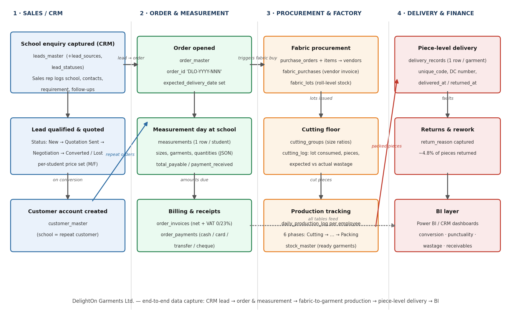
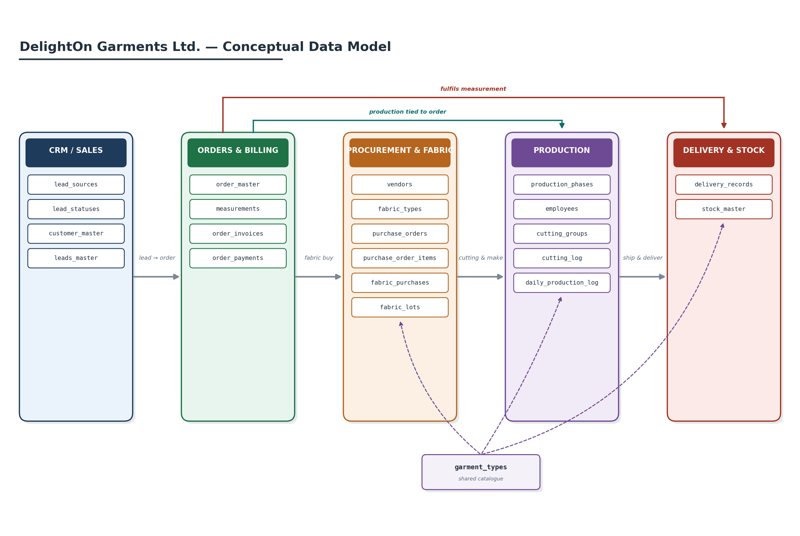
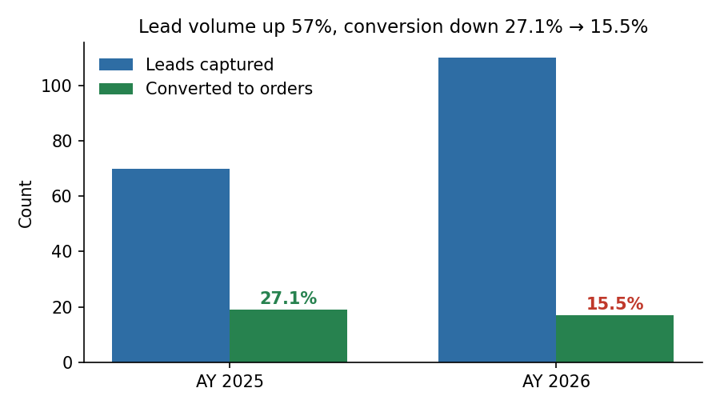
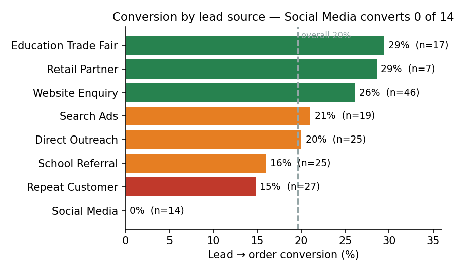
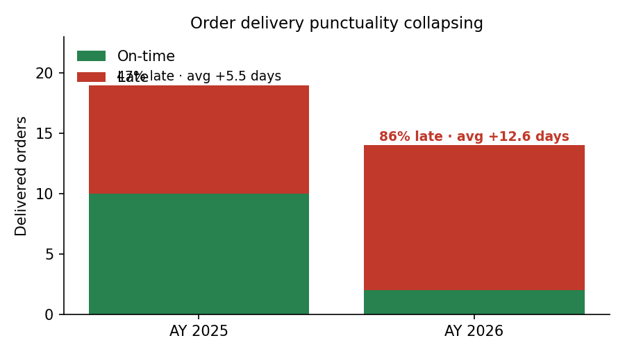
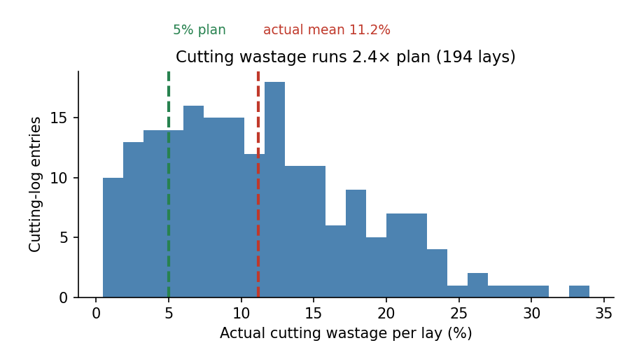
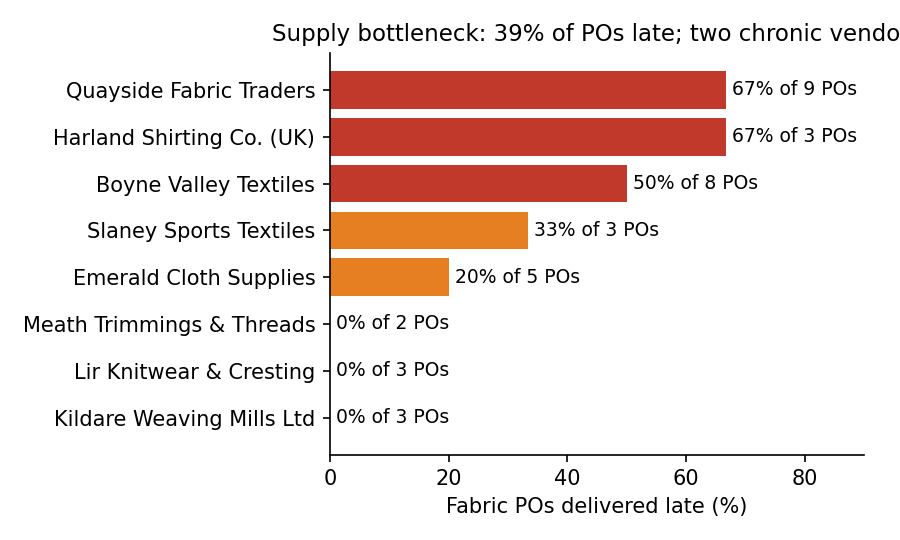
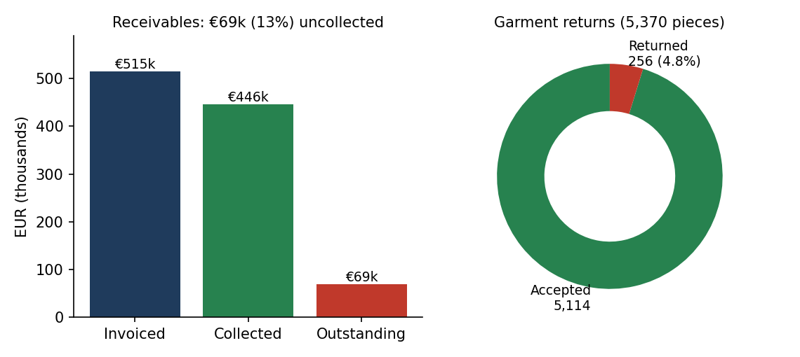

# DelightOn Garments: Data Architecture and Business Intelligence

**Python · pandas · Faker · PostgreSQL · Tableau · SWOT and gap analysis**

DelightOn Garments makes school uniforms for schools across Ireland. On paper, the business was growing: more schools were enquiring than ever before. In reality, it was winning fewer of them, delivering most orders late, wasting twice the fabric it should, and losing sight of who still owed it money.

None of this was visible, because the business had no joined-up data. So I set out to answer two questions: *what data would DelightOn need to see these problems early, and what does that data actually say?*

---

## The problem in four numbers

| Area | What was happening |
|---|---|
| **Sales** | Lead volume rose 57%, but conversion fell from **27.1% to 15.5%**. Social media brought in 14 leads and converted none of them. |
| **Delivery** | **86%** of orders arrived late, up from 47% the year before. |
| **Production** | Fabric wastage averaged **11.2%** against a **5%** target, with some cuts reaching 34%. |
| **Finance** | Around **€69,000** in unpaid invoices, with no central place to see it. |

## My role

This was an MSc team project. My part covered everything except the Salesforce CRM:

- The SWOT and gap analysis that linked each business problem to the data needed to fix it
- The PostgreSQL data model: 23 tables, 338 columns and 66 validated foreign keys
- The synthetic dataset and the script that generates it
- The exploratory data analysis
- The Tableau dashboards, and a head-to-head comparison with an AI-generated dashboard

The CRM build in [`/CRM`](CRM) was done by my teammates. I've kept it here so the full solution lives in one place.

---

## How I approached it

### 1. Start with the business questions, not the data

Before writing a single table, I turned each problem into a question, worked out which records could answer it, and decided how the answer should be shown. *"Which orders and vendors cause late delivery?"*, for example, needs expected and actual dates on orders, deliveries and fabric purchase orders, and ends up as a punctuality dashboard with a vendor breakdown. That mapping kept every later decision honest.



The data is captured at four points in the business: the sales office, measurement visits at each school, the factory floor and delivery.

### 2. A data model that works for daily operations and for reporting



The schema has **23 tables across five areas**: CRM and Sales, Orders and Billing, Procurement and Fabric, Production and Delivery, and Stock. Three choices shaped it:

- **Every relationship is a real foreign key.** All 66 are validated, and nothing relies on two columns happening to share a name.
- **Machines and people get different keys.** Each order has a numeric ID for joins and a readable code (`DLO…`) for staff and customers.
- **It's documented.** The [data dictionary](docs/architecture/data_dictionary.csv) and [relationship list](docs/architecture/relationships.csv) describe every table and link.

### 3. A dataset that behaves like a real Irish business

Real customer data was never an option, so I wrote [`generate_mock_data.py`](src/mock_generation/generate_mock_data.py) to build about **13,600 rows** of realistic data:

- **Reproducible:** a fixed random seed (`4321`) means anyone who runs it gets exactly the same dataset.
- **GDPR-safe:** every name, phone number, email and address is invented, using Faker's Irish locale. The data even has proper Eircodes and +353 numbers.
- **Locally accurate:** Irish VAT is applied by product, at 23% for adult clothing and fabric and 0% for children's clothing.
- **Checked twice:** first by code, confirming no record points to a parent that doesn't exist across all 66 relationships, and then by loading everything into a live database.

### 4. Exploring the data

| Leads and conversion | Conversion by source | Order punctuality |
|---|---|---|
|  |  |  |

| Cutting-floor wastage | Fabric lateness by vendor | Receivables and returns |
|---|---|---|
|  |  |  |

All four problems show up clearly. The EDA also brought out the detail behind them: a social-media channel that never converted, and late fabric deliveries concentrated in just two suppliers.

### 5. Tableau dashboards

The original plan was Power BI, but Power BI Desktop doesn't run on macOS, so I built the dashboards in Tableau. Instead of loading all 23 tables into one heavy model, I created **three focused data sources**, each mirroring one part of the ERD.

| Dashboard | What it shows |
|---|---|
| **Operations** | Only **36.4%** of orders arrived on time, with an average delay of **8.5 days**. Quality Check is the bottleneck, with about 21,500 pieces waiting against 17,200 processed. |
| **Fabric and waste** | **10.76%** of 20,175 metres of fabric was wasted, double the target. Two vendors make up about **€89,000** of the €209,214 fabric spend. |
| **Financial** | **€514,905** invoiced, with about **€69,000 (13%)** still outstanding. |

One thing caught me out during the build. Tableau kept suggesting joins on the readable order codes instead of the numeric keys, which quietly produced empty results. After that, I checked every relationship by hand against the data dictionary before adding it.

### 6. My dashboard vs an AI-designed dashboard

Out of curiosity, I described the dataset to an AI tool (Anthropic's Claude), asked it to design a dashboard, and compared the result with mine.

- **The AI was genuinely good at design.** It put outcomes (delivery and cash) at the top and their causes (production and wastage) underneath, and used a diverging colour scale for delays plus an "on plan" reference line for wastage. That layout was better organised than my three separate screens.
- **It struggled with context.** It used field names that don't exist in the schema and assumed a single data model. It also calculated financial exposure as **€221,635** (everything invoiced minus payments received), while my dashboard showed the contractual balance of **€69,000**. Both numbers are "right"; they answer different questions, because part of each invoice is paid upfront and never appears as a payment.

My takeaway: AI makes a fast design partner, but its numbers always need checking against how the business actually defines them.

---

## Run it yourself

```bash
# 1. Install the dependencies
pip install pandas numpy faker

# 2. Generate the dataset (one CSV per table)
python src/mock_generation/generate_mock_data.py delighton_data

# 3. Create the schema in PostgreSQL, then load the CSVs with \copy or any tool you prefer
psql -d delighton -f src/database_setup/schema_2.sql
```

If you'd rather skip the setup, a ready-made copy of the data is in [`data/processed_data/delighton_mock_data.zip`](data/processed_data/delighton_mock_data.zip).

## What's in this repo

```
├── src/
│   ├── database_setup/schema_2.sql           # PostgreSQL schema (23 tables)
│   └── mock_generation/generate_mock_data.py # Synthetic data generator
├── data/processed_data/                      # The generated dataset (zipped)
├── docs/
│   ├── architecture/                         # Data dictionary, relationships, ERD
│   └── 01_Specification_Report/              # Full specification report
├── assets/report_screenshots/                # Architecture, ERD and EDA charts
└── CRM/                                      # Salesforce CRM build (teammates)
```

## Being honest about the limits

- **The data is synthetic.** The business problems were deliberately built into the generator, so the analysis confirms they're visible rather than stumbling on them by chance. The real value is the method, which would carry straight over to a real company's data.
- **The dashboards are a snapshot.** They aren't connected to a live system.
- **The AI comparison is one experiment with one tool.** It's an observation, not a benchmark.

## What I'm taking away

- A data model is only as useful as the questions it can answer, so start with the questions.
- Getting keys and relationships right early saves hours later. Clean keys are what made the dashboards possible.
- BI tools try to be helpful with automatic joins. Always check them.
- Treat AI output like a capable colleague's first draft: often good, always reviewed.

---

**Preetham Nachimuttu** · MSc Data Analytics, National College of Ireland · [LinkedIn](https://www.linkedin.com/in/preetham905020) · [GitHub](https://github.com/PreethamPortfolio)
